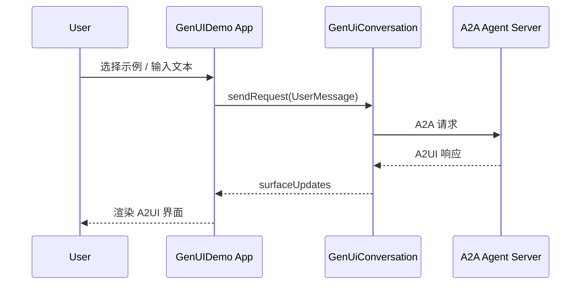

# genuidemo

A new Flutter project.

## Getting Started

This project is a starting point for a Flutter application.

A few resources to get you started if this is your first Flutter project:

- [Learn Flutter](https://docs.flutter.dev/get-started/learn-flutter)
- [Write your first Flutter app](https://docs.flutter.dev/get-started/codelab)
- [Flutter learning resources](https://docs.flutter.dev/reference/learning-resources)

For help getting started with Flutter development, view the
[online documentation](https://docs.flutter.dev/), which offers tutorials,
samples, guidance on mobile development, and a full API reference.

## GenUI 客户端流程（简化）

流程要点：
- 首页点击示例按钮进入对应 Demo 页面
- 用户输入并发送请求到 A2A 服务
- 服务端返回 A2UI 消息，客户端解析并渲染为 Flutter UI

## 示例流程拆解：北京未来三天天气

以“北京未来三天天气”为例，下面按 Flutter 端与 A2UI 服务端拆解关键流程。

### Flutter 端（GenUIDemo）

1. 用户输入并点击发送  
   `GenUIDemo/lib/main.dart` 中 `ExamplePage._sendRequest()` 调用  
   `GenUiConversation.sendRequest(UserMessage.text(text))`

2. 请求发送到 A2A 服务  
   `A2uiContentGenerator` 连接 `serverUrl`（当前 `_defaultServerUrl`）  
   向 `http://<host>:10002/a2a` 发送 A2A 请求

3. 接收 A2UI 响应并触发 UI 更新  
   `A2uiMessageProcessor` 解析 A2UI 消息 → 生成 `surfaceUpdates`  
   `GenUiSurfacesView` 监听 `surfaceUpdates`，提取 `surfaceId`

4. 渲染 A2UI  
   `GenUiSurfaceWidget` → `GenUiSurface`  
   根据 `surfaceId` 渲染为 Flutter Widget

### A2UI / 服务端（weather_lookup）

1. 接收请求  
   `samples/agent/adk/weather_lookup/__main__.py` 启动 A2A 服务  
   请求进入 `samples/agent/adk/weather_lookup/agent_executor.py`

2. 选择 UI/文本模式  
   `agent_executor.py` 中 `try_activate_a2ui_extension()` 判断是否启用 A2UI  
   启用后调用 `WeatherAgent(use_ui=True)`

3. LLM 调用工具  
   `agent.py` 构造 UI Prompt  
   LLM 调用 `get_weather(city="Beijing", days=3)`

4. 工具返回数据  
   `tools.py` 读取 `weather_data.json`  
   输出扁平字段：`current_temp_c` / `current_condition` / `current_meta` / `forecast`

5. 生成 A2UI JSON  
   `prompt_builder.py` + `a2ui_examples.py`  
   选择 `FORECAST_LIST_EXAMPLE`（因为 3 天）

6. 校验并返回  
   `agent.py` 使用 `jsonschema` 校验 A2UI JSON  
   `agent_executor.py` 拆分 `---a2ui_JSON---` 并打包为 A2A DataPart 返回
