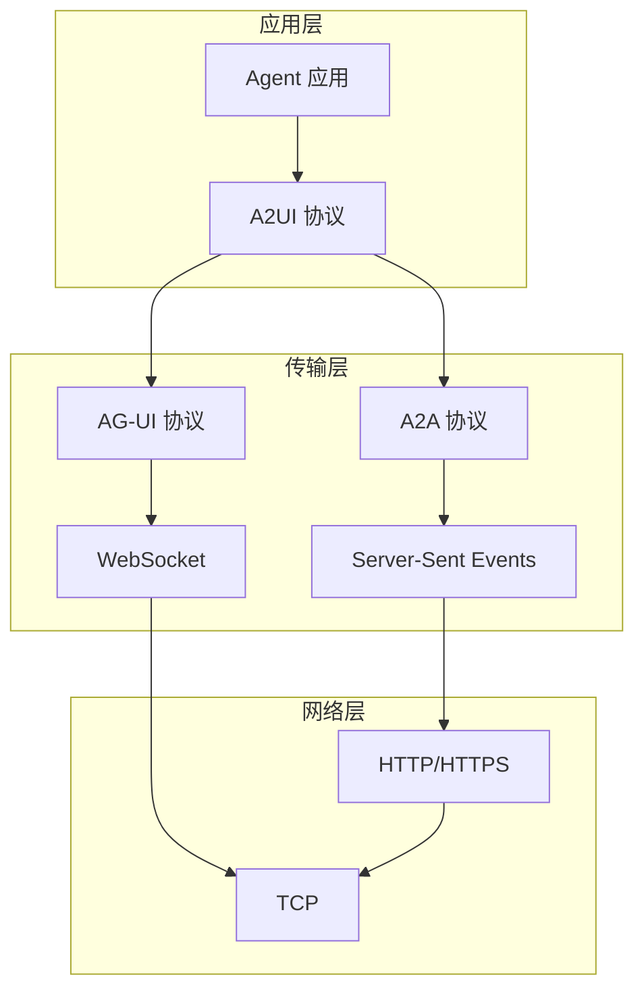
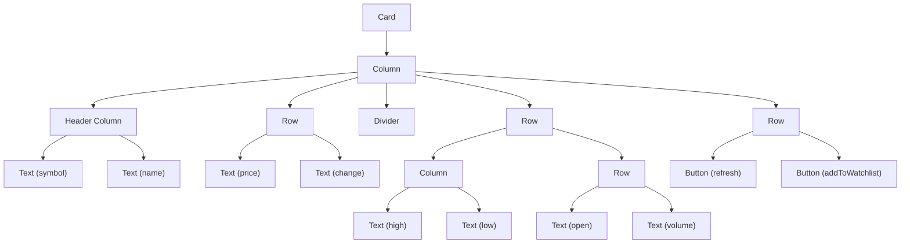
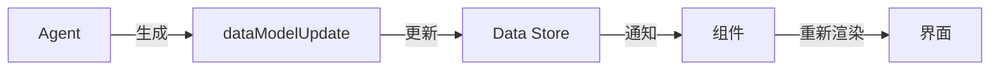
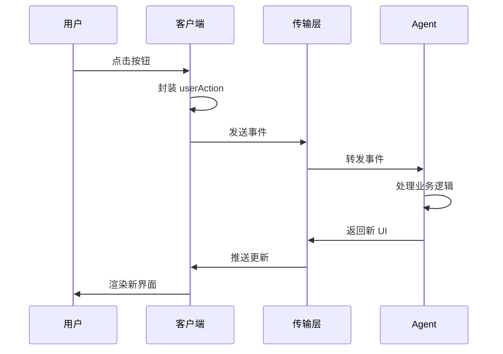

# A2UI：面向 Agent 的声明式 UI 协议（三）：相关概念和技术架构

> 本文是 A2UI 技术博客系列的第三篇，将深入解析 A2UI 的技术架构，包括协议栈关系、消息结构、组件系统和数据绑定机制。

基于股票查询示例，深入解析 A2UI 的技术架构，包括协议栈关系、消息结构、组件系统和数据绑定机制。

## 3.1 协议栈关系

A2UI 并非独立存在，而是构建在多层协议之上。理解这些协议的关系是理解 A2UI 的基础。



### 协议层次说明

| 层级 | 协议 | 职责 |
|------|------|------|
| **应用层** | A2UI | 声明式 UI 描述协议 |
| **传输层** | A2A/AG-UI | Agent 间通信协议 |
| **传输层** | SSE/WebSocket | 实时数据传输 |
| **网络层** | HTTP/TCP | 基础网络通信 |

### 关键特性

1. **协议无关性**：A2UI 可以通过多种传输协议传递
2. **向后兼容**：支持纯文本模式和富 UI 模式
3. **扩展性**：可以添加新的传输层支持

## 3.2 消息结构

A2UI 定义了三种核心消息类型，用于描述完整的 UI 生命周期。

### 3.2.1 beginRendering - 初始化渲染

```json
{
  "type": "beginRendering",
  "surfaceId": "stock-card-001",
  "surfaceType": "card"
}
```

**作用**：
- 声明新的 UI Surface 开始渲染
- 分配唯一的 surfaceId
- 指定 Surface 类型（card、dialog、sheet 等）

### 3.2.2 surfaceUpdate - 定义组件树

```json
{
  "type": "surfaceUpdate",
  "surfaceId": "stock-card-001",
  "components": [
    {
      "id": "header",
      "component": {
        "Column": {
          "children": ["symbolText", "priceText", "changeText"]
        }
      }
    },
    {
      "id": "symbolText",
      "component": {
        "Text": {
          "text": { "path": "symbol" },
          "style": "headline"
        }
      }
    },
    {
      "id": "priceText",
      "component": {
        "Text": {
          "text": { "path": "price" },
          "style": "title"
        }
      }
    }
  ]
}
```

**核心概念**：
- **扁平结构**：所有组件在同一层级，通过 ID 引用
- **组件树**：通过 children 数组构建层次关系
- **ID 引用**：组件间通过 ID 建立父子关系

### 3.2.3 dataModelUpdate - 填充数据

```json
{
  "type": "dataModelUpdate",
  "surfaceId": "stock-card-001",
  "contents": {
    "symbol": "AAPL",
    "price": "$145.09",
    "change": "+1.23 (+0.85%)",
    "companyName": "Apple Inc."
  }
}
```

**数据绑定机制**：
- **路径引用**：组件通过 `{ "path": "symbol" }` 引用数据
- **自动更新**：数据变化时自动重新渲染对应组件
- **类型安全**：支持数据类型校验

## 3.3 组件系统

A2UI 定义了一套抽象的组件系统，客户端负责映射到具体的 UI 框架。

### 3.3.1 组件分类

| 分类 | 组件 | 说明 |
|------|------|------|
| **布局** | Column, Row, Container, Stack | 布局容器 |
| **显示** | Text, Image, Icon | 内容展示 |
| **交互** | Button, TextField, Checkbox | 用户输入 |
| **结构** | Card, Sheet, Dialog | 界面结构 |

### 3.3.2 股票卡片组件树

以股票查询 Demo 为例，展示完整的组件树结构：



### 3.3.3 组件属性详解

#### Text 组件

```json
{
  "Text": {
    "text": { "path": "symbol" },
    "style": "headline",
    "color": { "path": "textColor" },
    "fontSize": 16,
    "fontWeight": "bold"
  }
}
```

#### Button 组件

```json
{
  "Button": {
    "child": "buttonText",
    "action": {
      "name": "addToWatchlist",
      "context": [
        { "key": "symbol", "value": { "path": "symbol" } },
        { "key": "name", "value": { "path": "name" } }
      ]
    },
    "style": "filled",
    "disabled": { "path": "isProcessing" }
  }
}
```

#### 交互机制

- **action.name**：定义动作名称
- **action.context**：传递上下文数据
- **数据绑定**：支持动态数据引用

## 3.4 数据绑定机制

A2UI 的数据绑定采用路径引用机制，实现了声明式的数据驱动 UI。

### 绑定语法

```json
{
  "text": { "path": "symbol" }
}
```

### 数据流



### 高级特性

#### 1. 条件渲染

```json
{
  "visible": { "path": "showDetails" },
  "component": { "Text": { "text": "详细信息" } }
}
```

#### 2. 列表渲染

```json
{
  "List": {
    "items": { "path": "watchlist" },
    "itemTemplate": {
      "id": "item-{index}",
      "component": {
        "Card": {
          "child": {
            "Text": { "text": { "path": "symbol" } }
          }
        }
      }
    }
  }
}
```

#### 3. 计算属性

```json
{
  "text": { 
    "compute": "formatPrice(price, currency)",
    "dependencies": ["price", "currency"]
  }
}
```

## 3.5 交互事件流

A2UI 定义了完整的交互事件处理机制，实现用户操作到 Agent 响应的闭环。

### 事件类型

| 事件类型 | 触发时机 | 数据格式 |
|----------|----------|----------|
| **userAction** | 用户点击按钮、输入文本 | `{ "name": "actionName", "context": {...} }` |
| **dataChange** | 数据字段变化 | `{ "field": "symbol", "value": "AAPL" }` |
| **lifecycle** | Surface 生命周期 | `{ "event": "mounted/unmounted" }` |

### 事件处理流程



### 事件处理最佳实践

#### 1. 动作命名规范

```json
{
  "name": "addToWatchlist",
  "context": {
    "symbol": "AAPL",
    "source": "stockCard"
  }
}
```

#### 2. 错误处理

```json
{
  "type": "error",
  "message": "添加到自选失败",
  "code": "WATCHLIST_ERROR",
  "retryable": true
}
```

#### 3. 加载状态

```json
{
  "type": "dataModelUpdate",
  "contents": {
    "loading": true,
    "buttonDisabled": true
  }
}
```

## 3.6 Schema 与校验

A2UI 提供了完整的 JSON Schema 定义，确保消息格式的一致性和正确性。

### 消息 Schema

```json
{
  "$schema": "http://json-schema.org/draft-07/schema#",
  "type": "object",
  "properties": {
    "type": {
      "enum": ["beginRendering", "surfaceUpdate", "dataModelUpdate"]
    },
    "surfaceId": {
      "type": "string",
      "pattern": "^[a-zA-Z0-9_-]+$"
    },
    "components": {
      "type": "array",
      "items": { "$ref": "#/definitions/component" }
    },
    "contents": {
      "type": "object"
    }
  },
  "required": ["type", "surfaceId"],
  "definitions": {
    "component": {
      "type": "object",
      "properties": {
        "id": { "type": "string" },
        "component": { "$ref": "#/definitions/componentDefinition" }
      },
      "required": ["id", "component"]
    }
  }
}
```

### 校验机制

#### 1. 服务端校验

```python
def validate_a2ui_message(message: dict) -> bool:
    """在发送前校验消息格式"""
    schema = load_a2ui_schema()
    return validate(message, schema)
```

#### 2. 客户端校验

```dart
bool isValidA2uiMessage(Map<String, dynamic> message) {
  // 客户端二次校验，防止恶意消息
  return _schemaValidator.validate(message);
}
```

#### 3. 运行时校验

```javascript
// 开发模式下的实时校验
if (process.env.NODE_ENV === 'development') {
  validateComponentTree(components);
}
```

## A2UI 的意义

### 1. Agent 应用商店概念的兴起

每个工具（股票 API、天气 API、日程工具等）不需要单独写前端。Agent 调用工具生成的 UI 就能直接呈现给用户，形成类似「Agent 应用商店」的生态：**工具 + UI = 可用产品**。

### 2. UI 也是 Agent 开发标准化的一环

开发流程变成「定义 Agent 功能 + 输出标准 UI」，客户端负责渲染，形成**模块化、可插拔**的智能应用生态。

### 3. 多 Agent 协作的 UI 工作流

在企业或复杂应用场景中，多 Agent 协作成为常态。每个 Agent 输出的 UI 都是工作流的一部分，用户操作可以跨 Agent 流转数据和事件，UI 成为 Agent 生态中的**统一工作流界面**。

通过这三篇文章，我们完整地介绍了 A2UI 从概念到实践再到技术原理的全过程。A2UI 为 Agent 驱动的 UI 提供了一个安全、高效、跨平台的解决方案，是构建下一代 AI 应用的重要基础设施。

---

*本系列文章：*
- *（一）A2UI 是什么*
- *（二）Demo时间之Agent服务端和客户端实现*
- *（三）相关概念和技术架构 ← 当前文章*

## 参考资料

- [A2UI 官方文档](https://a2ui.org/)
- [GenUI GitHub](https://github.com/anthropics/genui)
- [A2A 协议规范](https://a2a.dev/)
- [AG-UI 协议文档](https://ag-ui.dev/)
