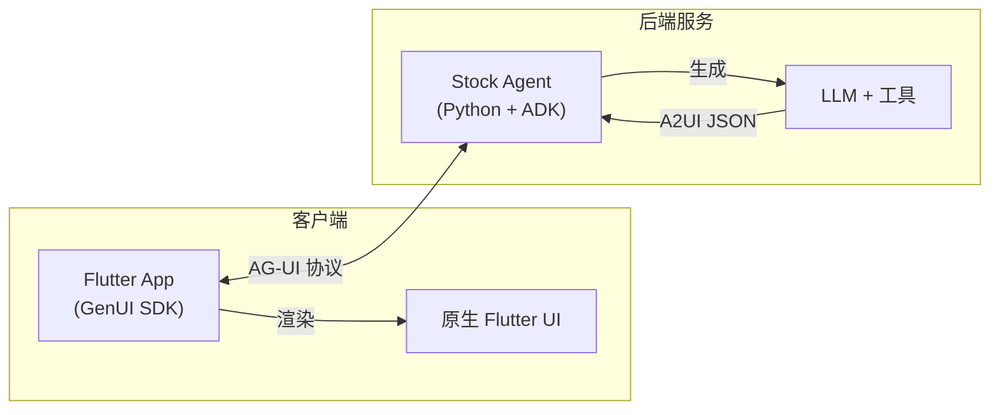
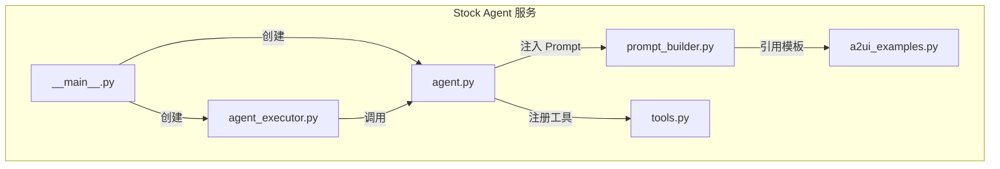
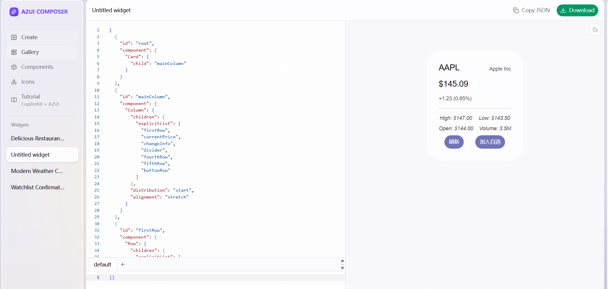
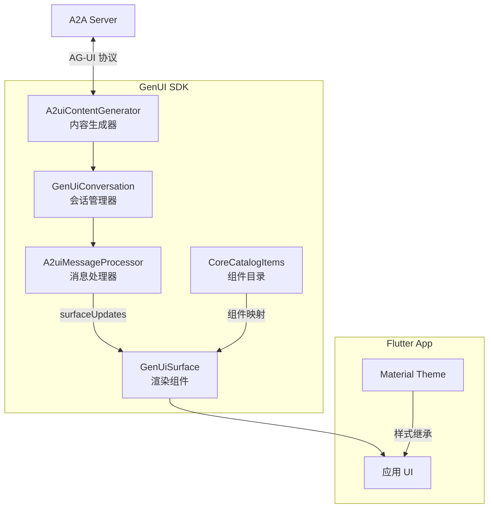
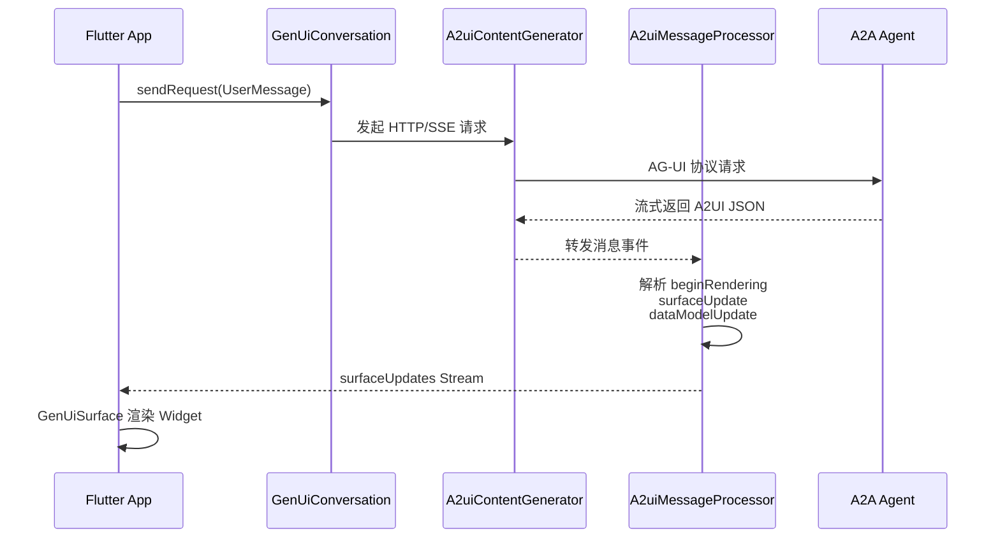
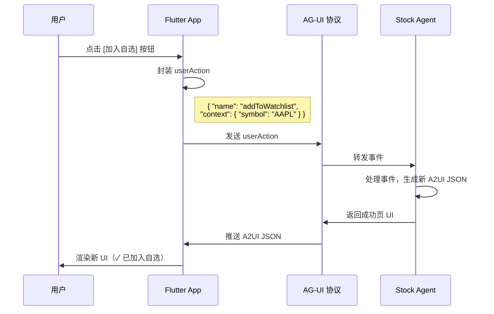

# A2UI：面向 Agent 的声明式 UI 协议（二）：Demo实践之Agent服务端和客户端实现

> 本文是 A2UI 技术博客系列的第二篇，将通过完整的股票查询 Demo，展示 A2UI 的实际工作方式。我们将详细解析 Agent 服务端和客户端的实现过程。

通过一个完整的股票查询示例，展示 A2UI 的实际工作方式。我们先看demo 最后的演示效果，先让大家对A2UI 有个最直观的感受。

<video controls width="720" title="股票查询 Demo 演示">
  <source src="video/20260309-153222.mp4" type="video/mp4">
  <p>您的浏览器不支持视频播放。<a href="video/20260309-153222.mp4">点击下载视频</a></p>
</video>

> 💡 **提示**: 如果视频无法播放，请点击这里查看演示: [video/20260309-153222.mp4](video/20260309-153222.mp4)

## 2.1 Demo 架构



## 2.2 Agent 服务端实现

以 `stock_lookup` 示例为例，展示如何实现一个 A2UI Agent。

> **本地示例路径**: [../a2ui_sample/agent](../a2ui_sample/agent)

### 项目结构

```
stock_lookup/
├── __main__.py          # 启动入口，配置 A2A 服务器
├── agent.py             # Agent 定义，注入 Prompt 和工具
├── agent_executor.py    # 事件处理，处理按钮回调
├── a2ui_examples.py     # A2UI 模板（股票卡片、成功页）
├── prompt_builder.py    # Prompt 构建，包含模板规则
├── tools.py             # 工具函数（get_stock_quote）
└── stock_data.json      # Mock 数据
```

### 文件职责



### 实现流程

实现一个 A2UI Agent 主要包含以下步骤：

#### 1. `a2ui_examples.py` - 设计 A2UI 模板

可以使用 [A2UI Composer](https://a2ui-composer.ag-ui.com/) 快速生成基础 JSON。例如，描述"股票卡片，显示代码、名称、价格、涨跌幅，底部有刷新和加入自选按钮"，Composer 会生成组件结构。

然后手动添加：
- **数据绑定**：将静态文本改为路径引用，如 `{ "path": "symbol" }`
- **按钮交互**：添加 `action` 定义，如 `{ "name": "addToWatchlist", "context": [...] }`

最终模板示例（股票卡片核心片段）：

```json
{ "id": "stockCode", "component": { "Text": { "text": { "path": "symbol" } } } },
{ "id": "addWatchlistBtn", "component": { 
    "Button": { 
      "child": "btnText",
      "action": { 
        "name": "addToWatchlist",
        "context": [
          { "key": "symbol", "value": { "path": "symbol" } },
          { "key": "name", "value": { "path": "name" } }
        ]
      } 
    } 
} }
```

成功页模板（`WATCHLIST_SUCCESS_EXAMPLE`）同理，包含确认图标、提示文本和后续操作按钮

#### 2. `tools.py` - 定义工具函数

实现 `get_stock_quote(symbol)` 工具，LLM 会在需要时自动调用。工具返回的数据将被 LLM 用于填充 A2UI 模板的 `dataModelUpdate`。

```python
def get_stock_quote(symbol: str, tool_context: ToolContext) -> str:
    """根据股票代码获取行情数据"""
    # 从 API 或 Mock 数据获取
    quote = fetch_quote(symbol)
    # 返回格式化的 JSON 字符串
    return json.dumps({
        "symbol": "AAPL",
        "name": "Apple Inc",
        "price": "145.09 USD",
        "change_summary": "+1.23 (+0.85%)",
        "high": "High: 147.00",
        "low": "Low: 143.50",
        ...
    })
```

工具返回的字段名需与 A2UI 模板中的 `path` 对应，LLM 会自动将数据填入 `dataModelUpdate.contents`

#### 3. `prompt_builder.py` - 构建 Prompt

Prompt 是让 LLM "知道如何生成 A2UI" 的关键，包含三部分：

- **输出格式规则**：要求 LLM 输出分为两部分，用 `---a2ui_JSON---` 分隔。第一部分是对话文本，第二部分是 A2UI JSON 数组。

- **模板选择规则**：指定不同场景使用哪个模板：
  ```
  - 查询股票详情 → 使用 STOCK_CARD_EXAMPLE
  - addToWatchlist 操作 → 使用 WATCHLIST_SUCCESS_EXAMPLE
  - refreshStock 操作 → 重新调用工具，使用 STOCK_CARD_EXAMPLE
  ```

- **A2UI 模板示例**：将 `a2ui_examples.py` 中的模板完整注入 Prompt，作为 few-shot 示例。

- **JSON Schema**：附加 A2UI 消息的 schema，用于输出校验。

这样 LLM 就能根据用户意图选择正确模板，并用工具返回的数据填充

#### 4. `agent.py` - 创建 Agent

定义 `StockAgent` 类，继承自 `SchemaValidatedA2uiAgent`，在构造时组装 LLM、Prompt 和工具：

```python
class StockAgent(SchemaValidatedA2uiAgent):
    def _build_agent(self, use_ui: bool) -> LlmAgent:
        instruction = get_ui_prompt(...) if use_ui else get_text_prompt()
        return LlmAgent(
            model=LiteLlm(model="gemini/gemini-2.5-flash"),
            instruction=instruction,
            tools=[get_stock_quote],
        )
```

通过 `use_ui` 参数区分两种模式：
- `ui_agent`：Prompt 包含 A2UI 模板，输出富交互界面
- `text_agent`：纯文本 Prompt，输出普通对话

#### 5. `agent_executor.py` - 实现事件处理

`StockAgentExecutor` 继承自 `SimpleA2uiAgentExecutor`，负责处理请求和事件回调。核心是重写 `resolve_query_from_event` 方法，将按钮点击转换为自然语言查询：

```python
def resolve_query_from_event(self, action: str, context_data: dict) -> str:
    if action == "addToWatchlist":
        symbol = context_data.get("symbol")
        return f"用户点击了加入自选，显示 WATCHLIST_SUCCESS_EXAMPLE..."
    elif action == "refreshStock":
        return f"刷新 {context_data.get('symbol')} 的数据..."
```

这样按钮点击就能触发 Agent 生成对应的响应 UI。

#### 6. `__main__.py` - 启动服务

配置并启动 A2A 服务器：

```python
# 定义 Agent 能力
capabilities = AgentCapabilities(
    streaming=True,
    extensions=[get_a2ui_agent_extension()],  # 声明支持 A2UI
)

# 创建 Agent 描述卡片
agent_card = AgentCard(
    name="Stock Agent",
    description="股票查询助手",
    capabilities=capabilities,
    skills=[skill],
)

# 启动服务
server = A2AStarletteApplication(agent_card=agent_card, ...)
uvicorn.run(app, host="localhost", port=10004)
```

`get_a2ui_agent_extension()` 会在 AgentCard 中声明 A2UI 扩展，客户端据此判断是否启用富 UI 渲染。

### 启动命令

```bash
cd samples/agent/adk/stock_lookup
uv run .
```

服务默认运行在 `http://localhost:10004`。

> 代码位置：`A2UI/samples/agent/adk/stock_lookup/`

## 2.3 客户端配置

### 1. A2UI支持哪些客户端框架


我们重点关注移动端的渲染框架Flutter (GenUI SDK)。

### 2. Flutter（GenUI SDK）重点介绍

GenUI 是 A2UI 协议的 Flutter 官方实现，提供了完整的客户端渲染能力。它将 Agent 生成的 A2UI JSON 消息转换为原生 Flutter Widget，实现跨平台（Android、iOS、Web、Desktop）的统一渲染。

#### 核心包

| 包名 | 版本 | 说明 |
|------|------|------|
| `genui` | ^0.7.0 | 核心渲染引擎，提供 Surface 管理和 Widget 映射 |
| `genui_a2ui` | ^0.7.0 | A2UI 协议适配层，处理 A2A/AG-UI 协议通信 |

#### 依赖配置

```yaml
# pubspec.yaml
dependencies:
  genui: ^0.7.0
  genui_a2ui: ^0.7.0
```

#### 架构设计



#### 核心组件说明

| 组件 | 职责 |
|------|------|
| `GenUiConversation` | 会话管理器，统一处理请求发送与响应接收 |
| `A2uiContentGenerator` | 内容生成器，负责与 A2A 服务端建立连接和通信 |
| `A2uiMessageProcessor` | 消息处理器，解析 A2UI JSON 并生成 Surface 更新流 |
| `GenUiSurface` | 渲染组件，将 surfaceId 映射为 Flutter Widget 树 |
| `CoreCatalogItems` | 组件目录，定义 A2UI 组件到 Flutter Widget 的映射规则 |

#### 最小实现示例
**本地示例路径**: [../a2ui_sample/agent](../a2ui_sample/client)
```dart
import 'package:flutter/material.dart';
import 'package:genui/genui.dart';
import 'package:genui_a2ui/genui_a2ui.dart';

class A2uiPage extends StatefulWidget {
  @override
  State<A2uiPage> createState() => _A2uiPageState();
}

class _A2uiPageState extends State<A2uiPage> {
  // 1. 消息处理器：解析 A2UI JSON，生成 Surface 更新
  late final A2uiMessageProcessor _processor = A2uiMessageProcessor(
    catalogs: [CoreCatalogItems.asCatalog()],
  );

  // 2. 内容生成器：连接 A2A 服务端
  late final A2uiContentGenerator _generator = A2uiContentGenerator(
    serverUrl: Uri.parse('http://localhost:10004'),
  );

  // 3. 会话管理器：串联请求与 UI 更新
  late final GenUiConversation _conversation = GenUiConversation(
    contentGenerator: _generator,
    a2uiMessageProcessor: _processor,
  );

  @override
  void dispose() {
    _conversation.dispose();
    super.dispose();
  }

  // 发送请求到 Agent
  Future<void> _sendQuery(String text) async {
    await _conversation.sendRequest(UserMessage.text(text));
  }

  @override
  Widget build(BuildContext context) {
    return Scaffold(
      body: StreamBuilder<GenUiUpdate>(
        // 4. 监听 Surface 更新流
        stream: _processor.surfaceUpdates,
        builder: (context, snapshot) {
          final surfaces = _conversation.conversation.value
              .whereType<AiUiMessage>()
              .map((msg) => msg.surfaceId)
              .toSet();

          return ListView.builder(
            itemCount: surfaces.length,
            itemBuilder: (context, index) {
              final surfaceId = surfaces.elementAt(index);
              // 5. 渲染 A2UI Surface
              return GenUiSurface(
                host: _conversation.host,
                surfaceId: surfaceId,
              );
            },
          );
        },
      ),
    );
  }
}
```

#### 工作流程



#### 关键特性

| 特性 | 说明 |
|------|------|
| **原生渲染** | A2UI 组件直接映射为 Flutter Widget，继承应用 Theme |
| **流式更新** | 支持 SSE 流式接收，UI 实时增量渲染 |
| **数据绑定** | 支持 `path` 引用，数据变化自动触发 UI 更新 |
| **交互回调** | 按钮 `action` 自动封装为 AG-UI 事件发回 Agent |
| **组件扩展** | 可通过自定义 Catalog 扩展组件映射 |

#### 组件映射示例

A2UI 组件与 Flutter Widget 的对应关系：

| A2UI 组件 | Flutter Widget |
|-----------|----------------|
| `Text` | `Text` |
| `Button` | `ElevatedButton` / `FilledButton` |
| `Column` | `Column` |
| `Row` | `Row` |
| `Card` | `Card` |
| `Image` | `Image.network` |
| `Icon` | `Icon` |
| `Container` | `Container` / `DecoratedBox` |

#### 调试技巧

```dart
// 打印 Surface 更新事件
_processor.surfaceUpdates.listen((update) {
  if (update is SurfaceAdded) {
    debugPrint('新增 Surface: ${update.surfaceId}');
  } else if (update is SurfaceUpdated) {
    debugPrint('更新 Surface: ${update.surfaceId}');
  }
});

// 打印 AI 消息详情
for (final msg in conversation.value.whereType<AiUiMessage>()) {
  debugPrint('surfaceId: ${msg.surfaceId}');
  debugPrint('components: ${msg.definition.components.length}');
}
```

> 参考：[GenUI GitHub](https://github.com/anthropics/genui) | [A2UI Renderers 文档](https://a2ui.org/renderers/)

## 2.4 交互流程



## 总结

通过这个股票查询 Demo，我们看到了 A2UI 的完整实现流程：

1. **服务端**：Agent 使用 Prompt 工程让 LLM 生成 A2UI JSON，通过 A2A 协议提供服务
2. **客户端**：Flutter GenUI SDK 解析 A2UI JSON，渲染为原生 Widget
3. **交互闭环**：按钮点击触发事件回调，实现完整的用户交互

在下一篇文章中，我们将深入解析 A2UI 的技术架构，包括协议栈关系、消息结构、组件系统和数据绑定机制。

---

*本系列文章：*
- *（一）A2UI 是什么*
- *（二）Demo时间之Agent服务端和客户端实现 ← 当前文章*
- *（三）相关概念和技术架构*
