# AI 助力 Android 工程化实践：（一）Figma MCP + Cursor 实现高效 UI 工程化

*—— 从 Figma 设计稿快速生成可复用 UI（支持 XML 与 Jetpack Compose）*

---

## 1. 背景

### 1.1 Android 开发中的 UI 困境

Android 开发者常被戏称为"UI仔"，这一称呼反映了 UI 开发的矛盾性：看似门槛低、可替代性强，实则是 Android 开发中最耗时且最关键的环节。高质量的 UI 开发需要深入理解设计规范、用户体验、性能优化和代码架构，这些能力构成了 Android 开发的核心竞争力。

### 1.2 传统 UI 开发的痛点

无论是 XML 还是 Jetpack Compose，传统 UI 开发流程存在以下痛点：

- **手动推断组件层级**：需要反复对照设计稿分析组件嵌套关系
- **参数调整繁琐**：颜色、字体、间距等设计参数需手动逐一配置
- **组件复用困难**：缺乏组件化思维，后期重构成本高
- **维护成本高**：设计稿变更时需要重新对照，进行像素级调整

### 1.3 传统 AI 辅助方案的局限性

直接将设计图截图提供给大模型生成代码的方式存在明显缺陷：

- **信息丢失**：截图无法传递精确的尺寸、间距、颜色值等结构化数据
- **层级推断错误**：AI 只能基于视觉关系推测组件层级，易产生错误的嵌套结构
- **精度不足**：关键参数（颜色、字体、边距）需要人工二次调整
- **缺乏组件化**：生成的代码难以复用，无法形成可维护的 UI 组件库
- **维护困难**：设计稿更新时需重新截图生成，无法建立设计稿与代码的关联

### 1.4 解决方案：Figma Context MCP

**Figma Context MCP + Cursor** 通过直接读取 Figma 的结构化数据（组件层级、尺寸、间距、颜色值等），消除了 AI 的猜测过程，能够生成精准、可复用的 UI 组件。该方案支持 XML 与 Jetpack Compose 两种输出格式，适用于不同技术栈的团队。

---

## 2. 什么是 MCP 与 Figma Context MCP

在 AI 助力 Android UI 工程化中，MCP（Model Context Protocol）是一个核心概念。它的作用是让 AI **不仅能看图"猜测"UI**，还能直接理解设计稿背后的结构化信息，从而生成精准、可复用的组件。

---

###  2.1 MCP（Model Context Protocol）

- **定义**：AI 与外部世界的标准接口，提供设计稿、项目上下文和资源的结构化数据。
- **作用**：

  1. 消除模糊猜测，让生成代码精确可交付
  2. 支持自动拆分组件，提高复用性
  3. 可以与团队架构规范（ViewModel、StateFlow、Hilt 等）结合

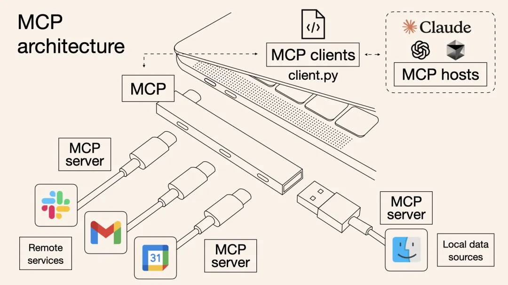

> MCP 是 AI 的"接口规范"，让它从"看图生成"升级为"理解设计、落地工程"的能力。

### 2.2 Figma Context MCP

- **定义**：MCP 在 Figma 场景下的应用扩展。
- **功能**：

  1. 读取 Figma 组件层级、Auto Layout、字体、颜色、图片资源
  2. 输出可直接使用的 XML 或 Jetpack Compose 组件
  3. 支持 Cursor / Windsurf 等 AI IDE 直接操作和代码生成

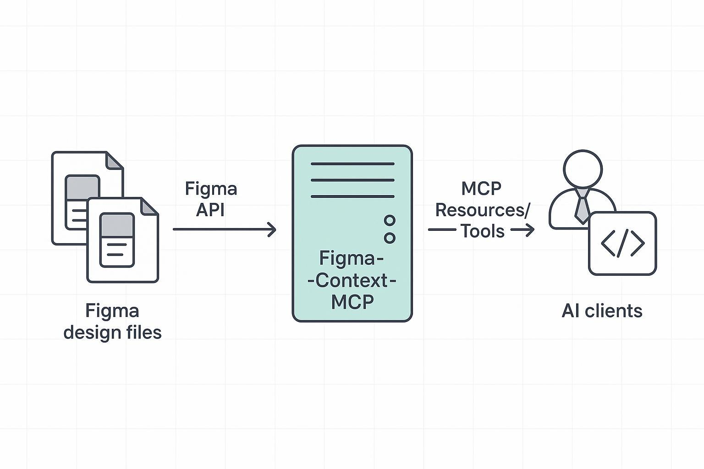

> Figma Context MCP 可以理解为 **MCP + Figma 设计稿上下文**，它让 AI 不再是"看图猜数据"，而是可以精准生成 Android 可用 UI 组件。

---

## 3. 从 0 配置 Figma MCP Server（社区版）并在 Cursor 使用

### 3.1 为什么选择社区版 Figma MCP Server？

在配置 Figma MCP Server 时，你可以选择官方 MCP Server 或社区版（如 GLips/Figma‑Context‑MCP）。本文选择 **社区版** 的原因如下：

1. **易于本地部署**

   - 社区版可以在本地完整运行，无需依赖远程官方服务器。
   - 适合团队内部网络环境或对数据安全有要求的项目。
2. **灵活可定制**

   - 社区版源代码开源，可根据团队需求修改或扩展 MCP 功能。
   - 例如，可以自定义返回的设计上下文格式、节点筛选逻辑等。
3. **与 AI IDE（如 Cursor）兼容性高**

   - 社区版支持标准 MCP 协议，能直接与 Cursor、Windsurf 等 AI IDE 对接。
   - 可通过 `mcp.json` 自由配置 `--stdio` 或 HTTP 模式，适配不同工作流。
4. **无访问限制**

   - 官方 MCP Server 有访问次数限制或账号绑定，社区版完全本地化部署，不受限制。

> 因此，对于希望快速集成 MCP 功能、保持本地可控、同时兼顾灵活扩展的 Android 开发团队，社区版是更适合的选择。

### 3.2  从 0 开始配置 Figma‑Context‑MCP

- **仓库地址（社区版 MCP Server）**
  [GLips / Figma‑Context‑MCP](https://github.com/GLips/Figma-Context-MCP)
  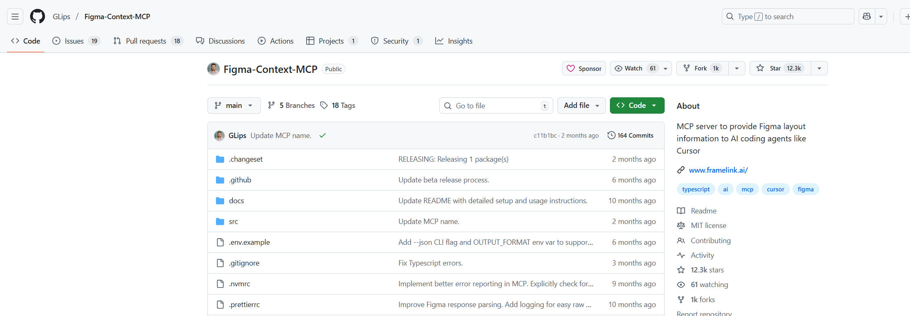

#### 1️⃣ 安装 Node.js

- MCP Server 基于 Node.js，需要安装 Node.js 18+
- 官方下载：https://nodejs.org

验证是否安装成功：

```bash
# 检查 Node.js 版本（需要 18+）
node -v

# 检查 npm 版本
npm -v
```

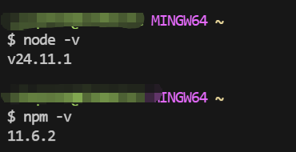

#### 2️⃣ 获取 Figma Personal Access Token（PAT）

登录 Figma → 头像 → **Settings → Personal Access Tokens → Generate new token**

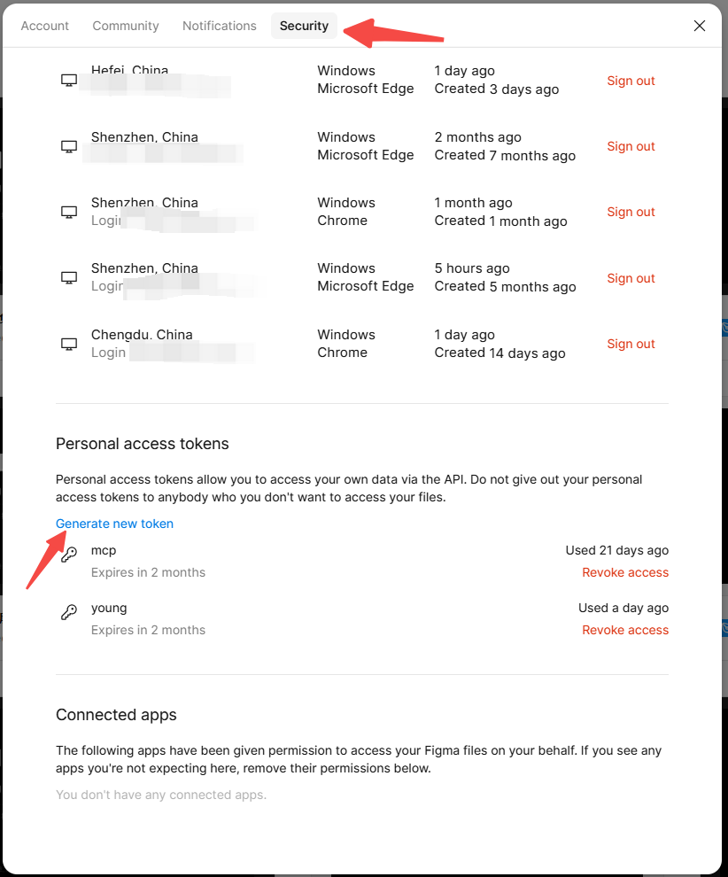

复制生成的 token，后续配置中会用到。

#### 3️⃣ 安装并启动 figma-developer-mcp（启动测试）

在命令行执行：

```bash
# 使用 npx 安装并启动 MCP Server 测试
# 注意：将 "记录的token" 替换为你自己的 Figma Personal Access Token
npx -y figma-developer-mcp --figma-api-key="记录的token"
```

> 💡 **提示**：`--stdio` 参数用于与 AI IDE 建立标准输入输出通信。启动后，终端会显示等待请求状态，说明 MCP Server 已启动。

⚠️ **如果报错，请先执行**：

```bash
# 升级 npm 到最新版本
npm install -g npm
```
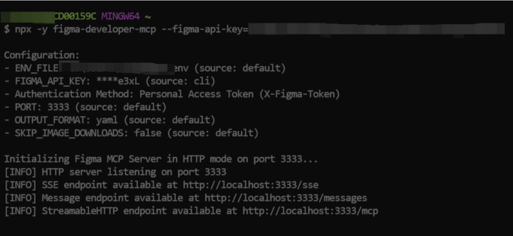

#### 4️⃣ 在 Cursor 中配置 MCP

打开Cursor的 setting，跳转到mcp.json 配置

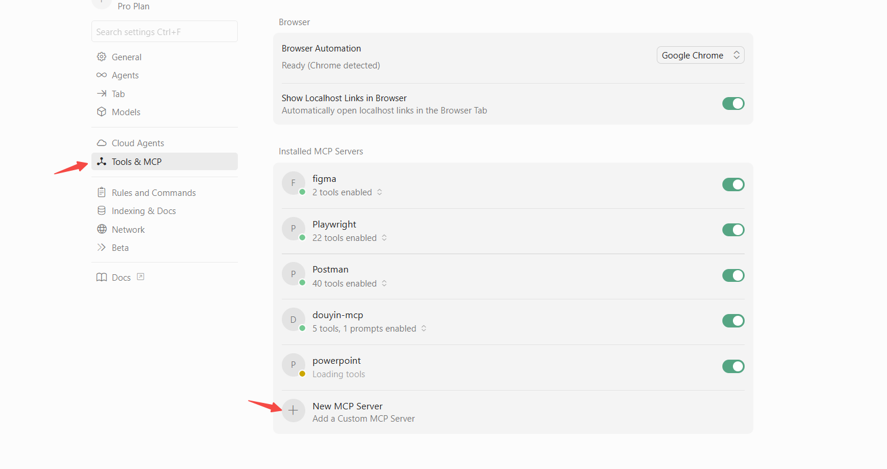

添加如下配置：

```json
{
  "mcpServers": {
    "figma": {
      "command": "npx",
      "args": [
        "-y",
        "figma-developer-mcp",
        "--stdio"
      ],
      "env": {
        "FIGMA_API_KEY": "你的 Figma Personal Access Token"
      }
    }
  }
}
```

> ⚠️ **重要**：请将 `"你的 Figma Personal Access Token"` 替换为你在步骤 2️⃣ 中获取的实际 token。

如图所示：

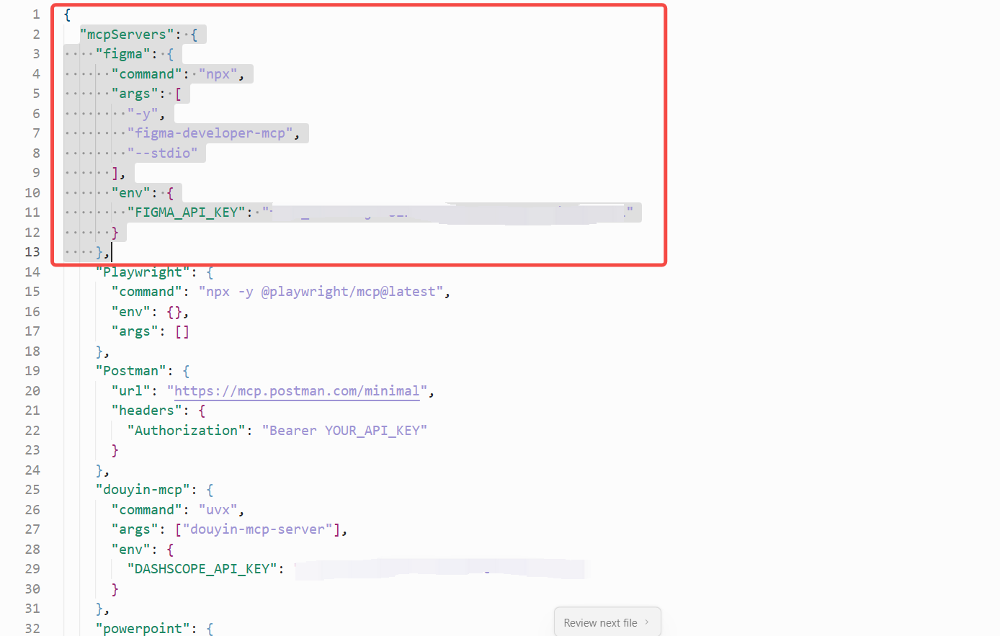

**配置解析**

- `"command": "npx"` → 使用 npx 启动 MCP Server
- `"args": ["-y","figma-developer-mcp","--stdio"]` → 指定包和参数，`--stdio` 让 Cursor 与 MCP Server 通信
- `"env"` → 设置环境变量，包括你的 Figma Token

**启动并测试 MCP Server**

在 Cursor 中使用 MCP 功能时，会自动执行以下命令：

```bash
# Cursor 自动执行的命令（使用环境变量中的 FIGMA_API_KEY）
npx -y figma-developer-mcp --stdio
```

> ⚠️ **注意**：有些版本的 MCP Server 使用 `--token` 参数，有些使用 `--figma-api-key`，请根据 MCP 帮助命令确认。

也可以手动验证：

```bash
# 手动验证 MCP Server（使用 --token 参数）
npx -y figma-developer-mcp --stdio --token "你的_token"

# 或者使用 --figma-api-key 参数（根据版本选择）
npx -y figma-developer-mcp --stdio --figma-api-key="你的_token"
```

> ✅ **成功标志**：输出连接信息或等待输入状态，说明 MCP Server 已启动。

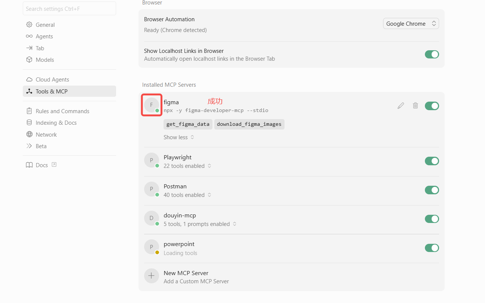

#### 5️⃣ 在 Cursor 中调用 MCP Server

在 Cursor 中使用 MCP 功能，可以通过以下方式测试：

**方式一：使用 Cursor 的 MCP 工具**

在 Cursor 中直接调用 `get_design_context` 工具，参数如下：

```yaml
file_url: "https://www.figma.com/design/LLf8XTSXNtkKam60pBo2XK/Android-Material-You-UI-Kit--Free---Community---Community-?node-id=1-246&t=wlDUQSMFU3ttrUud-0"
include_components: true
include_styles: true
include_text: true
limit_nodes: 10
```

**方式二：在 Cursor 聊天中直接请求**

```
请使用 Figma MCP 获取以下设计稿的上下文信息：
- URL: https://www.figma.com/design/LLf8XTSXNtkKam60pBo2XK/Android-Material-You-UI-Kit--Free---Community---Community-?node-id=1-246&t=wlDUQSMFU3ttrUud-0
- 包含组件、样式和文本信息
```

> ✅ **成功标志**：如果返回设计稿的组件、变量、布局信息，说明配置成功。

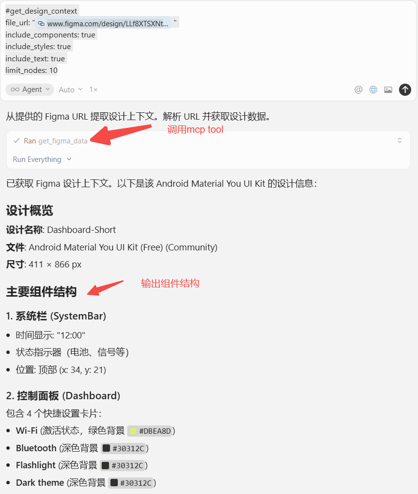

#### 6️⃣ 常见问题

| 问题                | 解决方法                                                        |
| ------------------- | --------------------------------------------------------------- |
| FIGMA_API_KEY 无效  | 确认 token 是 Personal Access Token，不是 OAuth Token           |
| npx 版本过低        | 升级 Node.js 或执行 `npm install -g npm`                       |
| MCP Server 启动失败 | 尝试加 `--debug` 参数，检查网络访问 Figma API 是否被防火墙拦截 |
| Cursor 没响应 MCP   | 检查 `mcp.json` 路径是否在 Cursor 默认配置目录下               |

**常见问题排查命令**：

```bash
# 检查 Node.js 和 npm 版本
node -v && npm -v

# 升级 npm
npm install -g npm

# 使用 debug 模式启动 MCP Server（查看详细日志）
npx -y figma-developer-mcp --stdio --debug --figma-api-key="你的token"

# 检查 Cursor 配置目录（Windows）
# Cursor 配置通常在：%APPDATA%\Cursor\User\globalStorage\rooveterinaryinc.roo-cline\settings\cline_mcp_settings.json
```

---

## 4. 实际效果

https://www.figma.com/design/LLf8XTSXNtkKam60pBo2XK/Android-Material-You-UI-Kit--Free---Community---Community-?node-id=1-246&t=wlDUQSMFU3ttrUud-0

以这个组件为例：

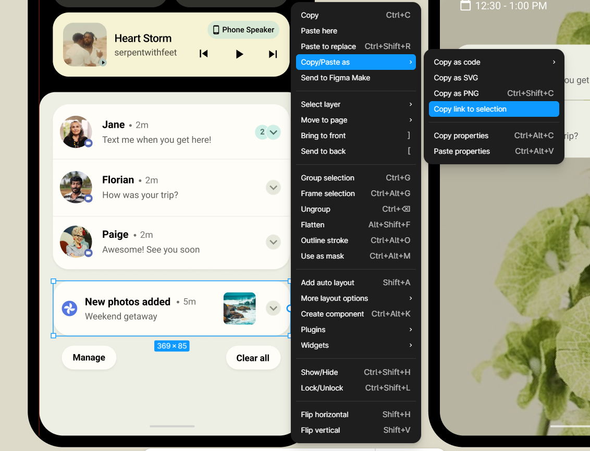

**示例 Prompt（Compose 版本）**

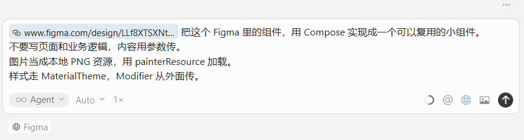

这一部分非常重要，它体现 **工程化思维，而不是“让 AI 随便生成”** 。

**实际生成的效果**

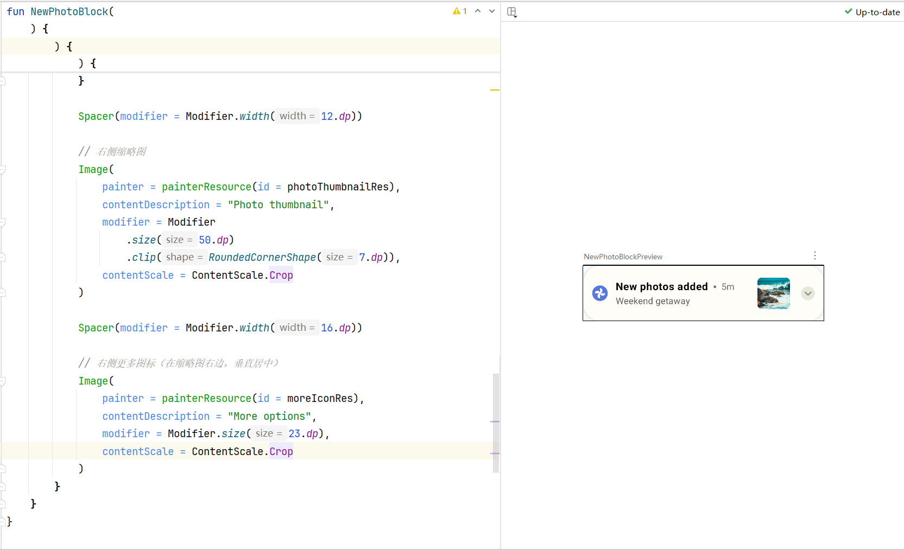

如果你喜欢用xml的方式，使用如下的prompt

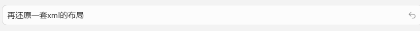

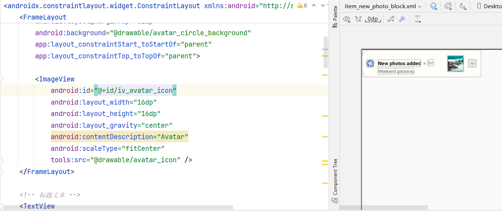

效果还是很震撼的，基本上还原程度可以达到95%以上。

传统流程中，一个中等复杂度的 UI 卡片通常需要：

* 分析设计稿结构与组件层级
* 手动计算 padding / spacing / 字体参数
* 编写 XML 或 Compose 代码
* 对照设计稿反复微调

  **这一过程往往需要反复调整半小时，甚至更久。**

使用 MCP 后：

* 设计结构、布局关系、参数由 MCP 直接提供
* 不再需要从figma loading 资源文件重命名放入工程的过程
* 开发者只需做工程规范和主题层面的调整

  **整体耗时可压缩到 5分钟以内** 。

---

## 5. 总结

### 5.1 未来展望

随着 MCP 生态的完善和 AI 能力的提升，我们可以期待：

- **智能优化**：AI 自动识别性能瓶颈并提供优化建议
- **设计稿同步**：设计稿变更时自动触发代码更新，实现真正的"设计即代码"
- **团队协作增强**：设计师在 Figma 中的操作直接反映到代码变更，形成闭环

### 5.2 相关资源

- [Figma Context MCP 仓库](https://github.com/GLips/Figma-Context-MCP)
- [Cursor 官方文档](https://cursor.sh/docs)
- [MCP 协议规范](https://modelcontextprotocol.io)

---

*本文是"AI 助力 Android 工程化实践"系列的第一篇，后续将分享更多 AI 在 Android 开发中的应用实践，敬请期待。*

