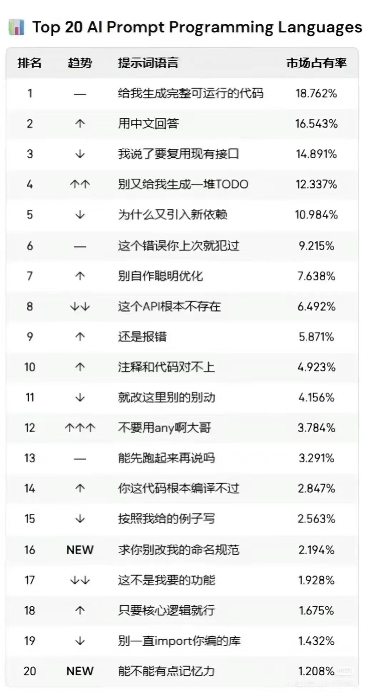
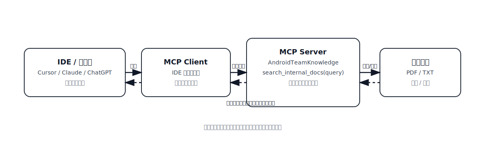
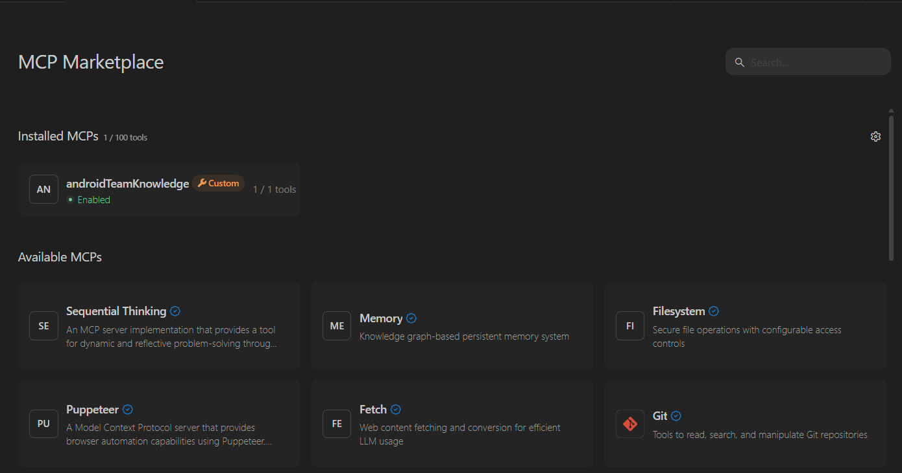
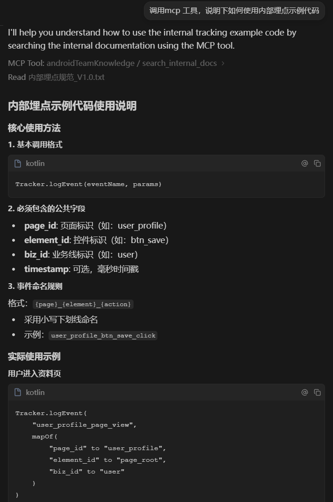
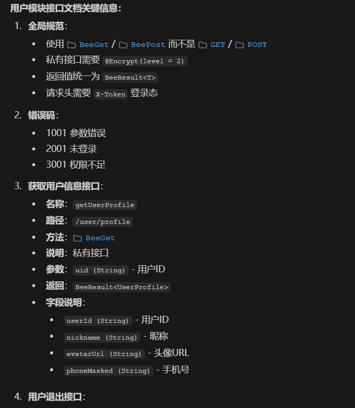

# AI 助力 Android 工程化实践：（三）自建 MCP Server：让大模型接入内部知识库

*—— 让 AI 不再“凭感觉回答”，而是基于你的内部文档给出可落地的结论与代码*

---

## 1. 背景
开局一张图



大模型懂公网知识，但看不见你的内部接口文档、私有 SDK、团队规范；你一旦问“内部问题”，它就可能开始“猜”，甚至编造接口/字段。

典型风险：

- 编造不存在的接口、参数、返回结构，联调直接翻车
- 把公网最佳实践当成内部规范，导致返工与规范失守

本文要做的事很简单：自建一个 MCP Server，把本地/内网内部文档“接入”到大模型，让回答基于检索到的文档片段而不是凭空发挥。

---

## 2. 具体实践：自建 MCP Server 接入内部知识库

> 这一章用 `demo/mcp-server/server.py` 这个最小例子，演示如何把本地/内网文档接入到大模型，让模型回答前先“查内部资料”。

 MCP Client -> MCP Server -> 内部文档目录）" width="800">

### 2.1 准备运行环境

这个 Demo 用 Python 实现，核心依赖：

- `mcp`：MCP Server 框架（FastMCP）
- `pypdf`（或 `PyPDF2`）：解析 PDF 文本

安装示例（按你的环境调整）：

```bash
pip install mcp pypdf
```

<!-- TODO: 插图：依赖安装/环境准备截图 -->

### 2.2 编写 MCP Server（核心代码）

MCP Server 的目标很简单：提供一个工具 `search_internal_docs(query)`，把内部文档里最相关的片段返回给大模型作为上下文。

**1）定义 MCP 服务与文档目录**

`demo/mcp-server/server.py`：

```python
from pathlib import Path
import os
from mcp.server.fastmcp import FastMCP

mcp = FastMCP("AndroidTeamKnowledge")

BASE_DIR = Path(os.environ.get("KNOWLEDGE_BASE_DIR", Path(__file__).resolve().parent.parent))
DOC_DIR = Path(os.environ.get("KNOWLEDGE_PDF_DIR", BASE_DIR / "internal_docs"))
```

**2）PDF/TXT 读取（兼容 pypdf / PyPDF2）**

```python
def _extract_text(pdf_path: Path) -> str:
    try:
        import pypdf as pdf_lib
    except Exception:
        import PyPDF2 as pdf_lib

    reader = pdf_lib.PdfReader(str(pdf_path))
    return "\n".join(page.extract_text() or "" for page in reader.pages)
```

**3）对外暴露检索工具：`search_internal_docs`**

```python
@mcp.tool()
def search_internal_docs(query: str) -> str:
    if not _DOCS:
        _build_index()
    tokens = _tokenize(query)
    if not tokens:
        return "No query tokens found."

    ranked = sorted(
        ((name, chunk, _score(tokens, chunk)) for name, chunk in _DOCS),
        key=lambda item: item[2],
        reverse=True,
    )
    top_hits = [item for item in ranked if item[2] > 0][:3]
    if not top_hits:
        return "No relevant passages found."

    lines = []
    for name, chunk, score in top_hits:
        lines.append(f"[{name}] score={score}")
        lines.append(chunk)
        lines.append("")
    return "\n".join(lines).strip()
```

> 你不需要一开始就上“向量库 + RAG 全家桶”。先把“内部文档可检索、可被大模型引用”跑通，收益立竿见影。

<!-- TODO: 插图：server.py 核心代码截图（可只截工具函数和返回结果格式） -->

### 2.3 在 Cursor 中接入 MCP Server

在 Cursor 的 `mcp.json` 添加一个本地 MCP Server 配置（示例）。下面是我在本项目里的实际配置：

```json
{
  "mcpServers": {
    "androidTeamKnowledge": {
      "args": [
        "E:\\codeStation\\android-vibe-coding\\demo\\mcp-server\\server.py"
      ],
      "command": "E:\\codeStation\\android-vibe-coding\\demo\\venv\\Scripts\\python.exe",
      "disabled": false,
      "env": {
        "KNOWLEDGE_PDF_DIR": "E:\\codeStation\\android-vibe-coding\\demo\\internal_docs"
      }
    }
  }
}
```

本地单独启动（用于排查环境问题）：

```bash
python demo/mcp-server/server.py
```

我的Cursor 额度用完了，所以我就用windsurf 做个示范😅🧪，绿灯亮起，说明MCP Server 已经连通，环境就绪。可以开始调用工具了。


### 2.4 实际效果验证

我们模拟一个典型的开发场景：团队内部沉淀了多份资料，例如[《内部埋点规范》（仅示例）](../demo/internal_docs/内部埋点规范_V1.0.txt)和[用户模块的接口文档](../demo/internal_docs/内部接口文档_用户模块_V1.0.pdf)。

1）验证埋点规范：
输入以下prompt：
> 调用mcp 工具，说明下如何使用内部埋点示例代码。
> 
{width=66%}

2）验证接口文档：
输入以下prompt：
> 请输出 用户模块接口文档的关键信息。
> 
{width=66%}

## 3. 总结


#### 1) 自建 MCP Server 的意义

- **让模型“查得到内部资料”**：把 PDF/TXT 等资料封装成工具能力（例如 `search_internal_docs`），模型先召回命中文段，再基于片段总结或生成代码。
- **减少胡编**：回答可以带上命中的文档片段或引用来源，结果更可追溯、更方便评审与复核。
- **知识资产化**：把规范、接口、FAQ 逐步纳入统一入口，减少“口口相传”的信息损耗。

#### 2) 现状：朴素关键词打分（为什么可以接受）

当前实现采用“关键词命中 + 简单切分”的方式做召回与排序，本质是一个 MVP：先把“文档加载 -> 检索 -> 基于片段回答”的链路跑通。

- **优点**：实现快、可解释、好排查（命中哪些词、哪个 chunk 一目了然）。
- **缺点**：对同义词/近义表达不敏感，排序质量一般；文档规模变大后，效果与性能都需要进一步工程化。

#### 3) 后续更优雅的工程化做法（方向）

这里的演进方向可以更明确地理解为：把当前 MVP 的关键词打分，升级为标准 RAG 流程：

- **Embedding 向量召回**：用语义检索解决同义词/表达差异带来的漏召回问题。
- **Rerank 重排**：对 TopK 结果二次排序，把最相关的片段优先提供给大模型。
- **（可选）混合检索**：向量检索 + 关键词检索组合，兼顾语义召回与精确匹配。

这类升级属于“工程化演进方向”：当文档规模、问题复杂度提升后，用更标准、更可控的检索链路来保证召回质量与稳定性。

相关示例代码与资料在 `demo/` 目录下：MCP Server 位于 `demo/mcp-server/`，示例内部文档位于 `demo/internal_docs/`.
